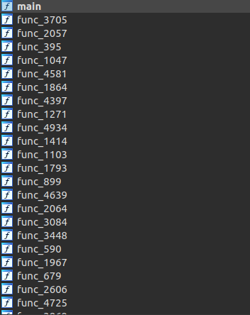
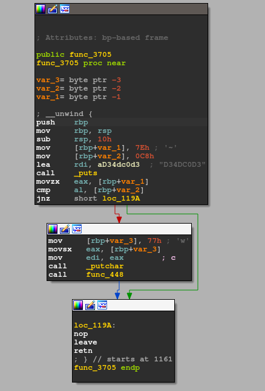
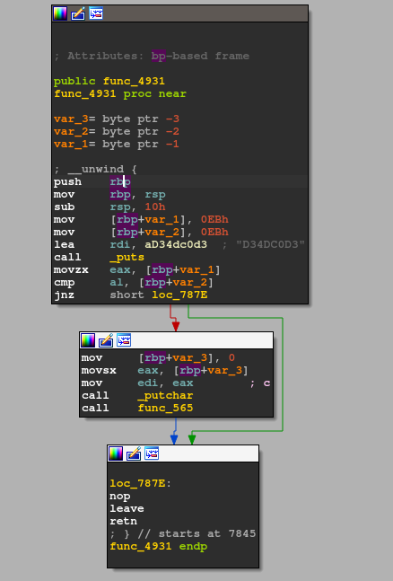

# n33dl3

I was given this [file](https://drive.google.com/file/d/1aasOG9-Zyl2YBSFNYLKcDBHRUrrlz2kb/view?usp=sharing), asked to find the flag. Pretty simple (sounding).

Upon running the script, it seems alright <br>


Pop it open on IDA, I find a buttload of functions <br>
 <br>
how lovely 🥲 <br> <br>

Looking at the `main` function, we can see it makes a call to `func_3705`, where can see: <br>
<br>


What this tells me is, some kind of check is being done, and based on the outcome of that, the code proceeds to call other functions. <br><br>
Looking at a couple other functions, I can tell they all do the exact same thing: check, and jump based on that. Nice. <br><br>
Next, I notice that almost all the values being checked are different from one another, and when they are different they don't pass the check and hence the program stops execution. <br><br>
So, patching. <br><br>


I then wrote an IDA script to patch all the `jnz` commands to `jz` commands, effectively flipping the logic. Then, upon running it, instead of getting the flag, the flow seemed to stop midway somewhere. <br>
I checked out that function to see what was going on and noticed this: <br>
 <br>
Man. <br><br>

So, I edited my script. It now evaluates the 2 values being checked and patches based on that. Cool. <br>
Now, upon running the code, I seem to be getting the flag, but it's still littered by D34DC0D3. <br>
<br>
We don't want that. <br>

So, I edited the script again to `nop` out all the `call` instructions being made to print out the litter. Should fix it. <br>
<br>
Voila! <br>

My final IDA script: <br>
```py

import idaapi 
import idautils 

func_addresses = []

for ea,name in idautils.Names():
    if "func_" in name:
        func_addresses.append(hex(ea))
        
        
for i in func_addresses:
    mov_1 = int(i, 16) + 0x8
    mov_2 = int(i, 16) + 0xc
    bytes_1 = idaapi.get_bytes(mov_1, 4)
    bytes_2 = idaapi.get_bytes(mov_2, 4)
    val_1 = bytes_1[3]
    val_2 = bytes_2[3]
    flag = 0
    if val_1 != val_2:
        flag = 1
    jz = int(i, 16) + 0x23
    actual = idaapi.get_bytes(jz, 4)
    actual = actual[0]
    if actual == 117 and flag == 1:
        idaapi.patch_byte(jz, 0x74)


for i in func_addresses:
    real = int(i, 16) + 0x17
    idaapi.patch_byte(real, 0x90)    
    idaapi.patch_byte(real + 0x1, 0x90)
    
    idaapi.patch_byte(real + 0x2, 0x90)
    idaapi.patch_byte(real + 0x3, 0x90) 
    idaapi.patch_byte(real + 0x4, 0x90)

```
<br><br>

PS: You can also solve this using gdb. I solved it with this script: <br>
```py
import gdb 

flag_char = []

gdb.execute("file n33dl3", to_string=True)
gdb.execute("rbreak", to_string=True)


gdb.execute("del break 1011 1012 1013 1 2 3 4 5 6 7 8 9", to_string=True) # removing unnecessary breakpoints 
gdb.execute("r", to_string=True)


gdb.execute("c", to_string=True) # will get us past main 

for i in range(1010):
	disassembly = gdb.execute("disassemble", to_string=True)
	disassembly = disassembly.split()
	func_name = (disassembly[6])
	print (func_name)
	func_name = func_name[:-1]
	gdb.execute("set $rip = {}+37".format(func_name), to_string=True)
	gdb.execute("ni", to_string=True)
	char = gdb.execute("x/bx $rbp - 3", to_string=True)
	flag_char.append(char[16:])
	gdb.execute("c", to_string=True)

print("FLAG IS HERE: \n")
print (''.join([chr(i) for i in flag_char]))
print('\n')
```
<br>

### `wsc{Th3_pr0m1s3_Of_4_Kn1sh!!}`
<br>
These are the 2 sensible ways I can think of to solve this challenge. Overall it was a decent challenge. Finding out *how* to write a script in IDA was the hardest part, after that I was able to manipulate stuff pretty easily. 

<br><br>

### Author
***th3mech4nic***
